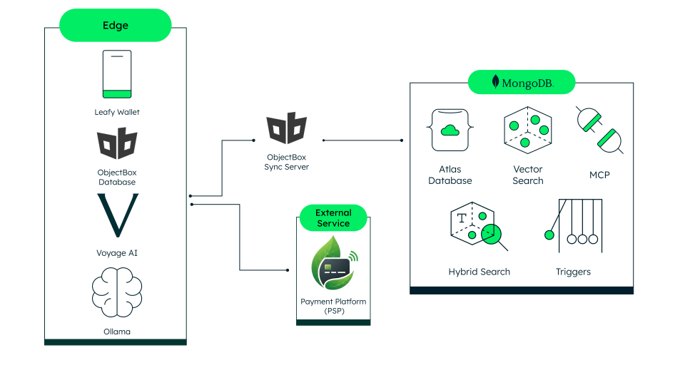
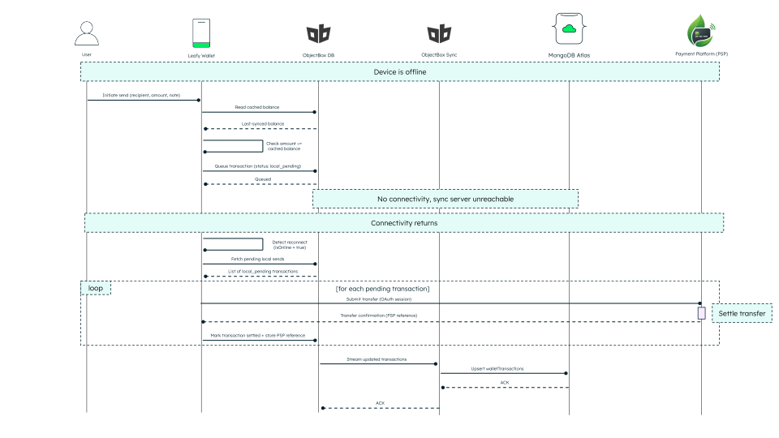

# Leafy Wallet

**Leafy Wallet is an offline-first personal wallet demo**, showcasing the integration of MongoDB's powerful features tailored specifically for [Financial Services](https://www.mongodb.com/solutions/industries/financial-services). The app keeps working with no connection at all: balances, activity, contacts, and even the AI assistant read from an on-device [ObjectBox](https://objectbox.io/) store, and everything syncs quietly to [MongoDB Atlas](https://www.mongodb.com/atlas) the moment the connection returns. It is designed to demonstrate how modern, customer-focused financial applications can treat connectivity as an enhancement rather than a requirement.

Leafy Wallet also features **Leafy**, an AI-powered assistant that answers questions about balances, spending, and past payments, and can draft payments for the user to confirm. The assistant runs entirely on a local [Ollama](https://ollama.com/) model routed through [LangGraph](https://www.langchain.com/langgraph), so it works online and offline alike.

## Components and Features:

Leafy Wallet is composed of several interconnected features that demonstrate the capabilities of a modern offline-first wallet. Users can:

1. **Sign in with SSO**
   - Real authorization-code + PKCE flow against the Payment Platform (PSP).
   - No credential ever touches the app; a passwordless (FaceID-style) re-entry path is included.

2. **Check balances and activity**
   - Balances and the full transaction history render from the on-device store instantly.
   - Each row carries its own settlement status, updated as transfers settle.

3. **Send and request money**
   - Sends execute real PSP transfers with a full review step (amount, recipient, note, source account).
   - Offline sends queue on the device and replay automatically on reconnect.
   - Requests are real PSP requests-to-pay: the payer approves in-app and the PSP moves the money.

4. **Manage contacts**
   - Add contacts by a registered PSP email or phone number; removing one also cleans up its Atlas replica.

5. **Receive notifications**
   - Money received and incoming payment requests, with swipe-to-clear and a full review flow for paying a request.

6. **Chat with the Leafy assistant**
   - Natural-language questions over the user's own data, streamed with a typewriter effect.
   - Spending questions render an inline per-contact breakdown chart.
   - Payment drafts appear as confirmation cards; nothing moves without the user's tap.

7. **Toggle the connection**
   - A presenter control simulates going offline and back online, driving the whole offline story.

## Where Does MongoDB Shine?



The edge (the wallet, its on-device ObjectBox store, and the local Ollama model) can run the whole experience alone. When it's online, it also syncs through the ObjectBox Sync Server into MongoDB Atlas, and talks directly to the Payment Platform for real transfers.

### 1. **Offline sync with ObjectBox and Atlas**
Wallet records written on the device (chats, requests, queued sends) stream up to Atlas through the ObjectBox Sync connector in the background, and Atlas-side changes stream back down. No spinners, no manual retry. On every login the wallet also reconciles against the PSP: enrichment rows for transfers or beneficiaries that no longer exist there are pruned, and transfers made outside the app are adopted, so the offline copy always mirrors the real ledger.



### 2. **Multi-document ACID transactions**
Transfers and their enrichment records stay consistent even when several offline writes land at once on reconnect. No double-spends, no drift.

### 3. **Hybrid search online, vector search on-device**
Transaction notes are embedded with [Voyage AI](https://www.mongodb.com/products/platform/ai-search-and-retrieval/models) and searchable by meaning in either mode. Online, Atlas fuses vector and full-text search with [`$rankFusion`](https://www.mongodb.com/docs/manual/reference/operator/aggregation/rankFusion/), so a paraphrase, an exact reference and a misspelling all find the right payment. Offline, ObjectBox's own HNSW index answers by meaning alone - the device has no full-text index, which is the one thing the cloud can do that the edge cannot. Embedding runs on the open-weight `voyage-4-nano`, so it needs no API key and works with no network at all.

### 4. **A LangGraph agent over local AI, through MCP**
The assistant routes each question to the right tool (balances, contacts, spending summaries, semantic search, payment drafting) and answers from tool results only. Online, the read tools call the backend's MongoDB MCP server; offline, the same tools read the on-device store. Aggregations like spending-by-contact are computed by the database, not by the model.

## Tech Stack

- **Database**:
  - [MongoDB Atlas](https://www.mongodb.com/atlas/database)
  - [ObjectBox](https://objectbox.io/) (on-device) with the [ObjectBox Sync Server](https://sync.objectbox.io/)

- **Web Framework**:
  - [Next.js](https://nextjs.org/) (App Router)

- **Backend**:
  - [FastAPI](https://fastapi.tiangolo.com/) on [uv](https://docs.astral.sh/uv/)

- **AI**:
  - [Ollama](https://ollama.com/) (qwen2.5:7b chat model)
  - [voyage-4-nano](https://huggingface.co/voyageai/voyage-4-nano) embeddings (in the `leafy-embed` container)
  - [LangGraph](https://www.langchain.com/langgraph)

- **Styling**:
  - [Tailwind CSS](https://tailwindcss.com/) v4
  - [LeafyGreen UI](https://github.com/mongodb/leafygreen-ui) accents

## Payment Platform (PSP) dependency

**The demo needs a running PSP instance.** The [PSP (`sec-fsi-pci-dss`)](https://github.com/mongodb-industry-solutions/sec-fsi-pci-dss) is the payment service provider that owns the demo identities, accounts, and transfers, and it hosts the SSO login the wallet signs in through. The wallet is deliberately thin on purpose: money and identity live in the PSP, and this repo only enriches them.

To run the demo, you'll need to:

1. Run the PSP locally, or deploy it to your own infrastructure.
2. Point `PSP_BASE_URL` and `PSP_FRONTEND_URL` in `frontend/.env.local` at your PSP instance.
3. Register the wallet's OAuth client (`CLIENT_ID`, `CLIENT_SECRET`, and a redirect URI of `<APP_BASE_URL>/api/auth/callback`) in that instance.

For the full walkthrough, ports, and environment files, see [LOCAL_DEPLOYMENT.md](LOCAL_DEPLOYMENT.md).

## Prerequisites

- [Docker](https://www.docker.com/) with Docker Compose
- [uv](https://docs.astral.sh/uv/getting-started/installation/), to run the search index script
- A MongoDB Atlas cluster (M0 or higher). If you don't have an account, sign up for free at [MongoDB Atlas](https://www.mongodb.com/cloud/atlas/register).
- A running [PSP (`sec-fsi-pci-dss`)](https://github.com/mongodb-industry-solutions/sec-fsi-pci-dss) instance (see the section above).

> **_Note:_** After cloning, run `./setup-hooks.sh` once. It installs a pre-commit hook (`security_check.sh`) that scans staged files for credentials before every commit.

### Add environment variables

> **_Note:_** Create a `.env.local` file within the `/frontend` directory and a `.env` file within the `/backend` directory. Ask the demo owner for the values.

```bash
# frontend/.env.local - everything else has a working local default
CLIENT_ID="<psp-oauth-client-id>"
CLIENT_SECRET="<psp-oauth-client-secret>"
PSP_BASE_URL="<psp-api-base-url>"
PSP_FRONTEND_URL="<psp-hosted-login-url>"
SESSION_SECRET="<random-string>"
```

```bash
# backend/.env
MONGODB_URI="<your-atlas-connection-string>"
DATABASE_NAME="<your-database-name>"
```

## Run with Docker

Make sure to run this on the root directory.

1. Create the Atlas search indexes behind hybrid transaction search (first run only). It reads
   `backend/.env`, so fill that in first:
```bash
cd backend && uv run python scripts/create_vector_index.py
```
2. Create the Atlas Database Trigger that copies settled transactions into `walletTransactionsHistory`
   (first run only). In the Atlas UI, add a Database Trigger on the `walletTransactions` collection
   watching Insert, Update and Replace with **Full Document enabled**, and paste
   [`backend/scripts/atlas_trigger_transaction_history.js`](backend/scripts/atlas_trigger_transaction_history.js)
   as its function. Edit the service name in that file to match your cluster, otherwise every
   invocation fails and the history collection stays empty.
3. Build and start every container:
```bash
make build
```
4. Activate the ObjectBox Sync Server trial license in the Admin UI at http://localhost:9980 (first run only).
5. Open the app at http://localhost:8080 and sign in with SSO as one of the demo users below.
6. To delete the containers and images run:
```bash
make clean
```

### Demo users

The demo revolves around three identities, seeded in MongoDB's shared PSP environment. Login is by email only:

| Name | Email | Password |
|---|---|---|
| Amara Okafor | `amara.okafor@back.es` | `demo-password` |
| Luis Fernandez | `luis.fernandez@back.es` | `demo-password` |
| Priya Patel | `priya.patel@back.es` | `demo-password` |

Tapping a profile card on the login screen hands both credentials to the PSP's hosted login form, so it arrives prefilled and you just confirm. Only "Continue with SSO" leaves the form empty and needs the password typed in.

> **_Note:_** Running your own PSP instance? These users won't exist there. Edit `frontend/src/lib/demo-users.js` to list the users seeded in your instance; the sign-in walkthrough displays whatever that file contains, and the prefill uses the same passwords.

The services and their ports:

| Service | Port | Purpose |
|---|---|---|
| frontend | 8080 | The wallet UI and the AI chat route |
| backend | 8000 | Atlas enrichment API (FastAPI) |
| leafy-local-store | 8090 | On-device ObjectBox store (C++ service) |
| objectbox-sync-server | 9980, 9999 | Sync admin UI and sync protocol |
| ollama | 11434 | Local chat model |
| leafy-embed | 8091 | Local embedding model (voyage-4-nano) |

## Repository Layout

- `frontend/` contains the Next.js app. See the [frontend README](frontend/README.md).
- `backend/` contains the FastAPI enrichment API. See the [backend README](backend/README.md).
- `leafy-local-store/` contains the C++ ObjectBox service that plays the role of on-device storage.
- `objectbox-sync-server/` contains the sync server model and data directory.

## Common errors

- **The first AI reply is slow or times out.** The chat model loads into memory on first use; the `ollama-pull` container warms it at startup, so wait for that container to exit before chatting.
- **Chats or requests don't sync.** The sync server uses ObjectBox's public trial image, which
  stops accepting transactions once the trial window closes - its logs then repeat
  `State condition failed ... : trial`. Activate the trial at http://localhost:9980.
- **"fetch failed" in the AI chat.** The frontend container can't reach Ollama; check that all containers are up with `docker ps`.
- **Payment requests never arrive.** The OAuth client must be allowed the `read:rtp` and `write:rtp` scopes in the PSP, and both people must have an active account there - the PSP refuses a request from someone who cannot receive money.

## 📄 License

See [LICENSE](LICENSE) file for details.
